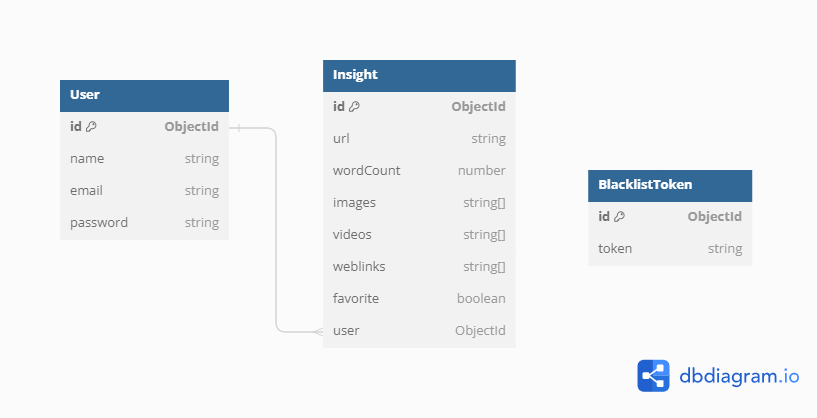

# Growth.cx_Assignment Word Count App

This URL Insight Tracker based web application is designed to extract and store word counts and media details from user-provided URLs. These insights are saved in a database, making them accessible for users. The application also provides the ability to retrieve all insights for a specific user, with optional filtering based on favorite status.


## Deployed Link Frontend

```bash
   https://growthcx-word-count.netlify.app/
```

## Deployed Link Backend

```bash
   https://growthcx-word-count-app.onrender.com/
```

## API Documentation Swagger

```bash
   https://growthcx-word-count-app.onrender.com/api-docs/
```

## Key Features

- **High Performance**: ensures that the tracking site can handle high traffic loads efficiently.
- **Scalability**: easily adapt to increased user demand by adding more servers or resources as needed.
- **API Development**: building APIs, to interact with frontend interfaces, mobile apps, and third-party services.
- **Database Integration**: can integrate with MongoDB, offering flexibility in choosing the right database solution.
- **Security**: protects sensitive customer information, such as encryption and authentication mechanisms.
- **User Authentication**: implement user accounts for features like saving preferences, accessing history across devices, and maintaining personalized settings.
- **URL Analysis**: Retrieve and store word count and media details from user-supplied URLs.
- **Insight Storage**: Save insights in a database for future reference and analysis.
- **User-Specific Insights**: Fetch all insights associated with a specific user.
- **Favorite Status Filtering**: Optional filtering to view insights based on favorite status.


## Tech Stack

- Frontend: HTML, CSS, JavaScript, Bootstrap
- Backend: Node.js, Express.js, MongoDB


## Getting Started

### Installation

1. Clone the repository:

   ```
   git clone https://github.com/aman1722/Growth.cx_Assignment
   ```
   
2. Go to Backend Directory
   ```
   cd Backend
   ```

3. Install Dependencies:
   ```
   npm install 
   ```

4. Application Start
   ```
   npm run server
   ```

5. Go to Frontend Directory
   ```
   cd Frontend
   ```

6. Open With Live Server


## Environment Variables Backend

You will need to set the following environment variables in a `.env` file:

```ini
PORT=`YOUR_REQUIRED_PORT`
MONGO_URL=`YOUR_MONGO_ATLAS_URL`
SALT_ROUNDS=`PROVIDE_A_NUMBER_FOR_HASHING_SALT_ROUND`
JWT_LOGIN_SECRET=`CREATE_A_SECRET_FOR_LOGIN_TOKEN`
```


### Users

- Register as a user.
- Log in with credentials using JWT token for authentication.
- Log out (blacklist the token).

### Insights

- Retrieve word count and media details from a URL and save in database as an insight.
- Get all insights for a specific user with optional filtering by favorite status(if we not pass any query then we got all insights.).
- Add an insight to favorites.
- Delete an insight by ID


#### Dummy User Credentials 1: 
email: `aman@gmail.com`
password: `Aman`


#### Dummy User Credentials 2: 
email: `chunnu@gmail.com`
password: `chunnu`


## Endpoints Reference

For detailed information on how to use our API, please refer to the [API documentation](Backend/docs/ApiDocs.md).


## Welcome Route

| Route           | Endpoint | Description                            | Features          |
| --------------- | -------- | -------------------------------------- | ----------------- |
| Welcome Message | GET /    | Provides a welcome message to the API. | - Welcome message |

## Swagger Docs

| Route             | Endpoint      | Description                       | Features                |
| ----------------- | ------------- | --------------------------------- | ----------------------- |
| API Documentation | GET /api-docs | Provides a Documentation for API. | - Swagger Documentation |

## Users

| Route           | Endpoint                       | Description                                                                                              | Features                               |
| --------------- | ------------------------------ | -------------------------------------------------------------------------------------------------------- | -------------------------------------- |
| Register User   | POST /user/register            | Register a new user with provided credentials.                                                           | - User registration                    |
| Login User      | POST /user/login               | Authenticate and log in a user with JWT token.                                                           | - User login with JWT token            |
| Logout User     | POST /user/logout              | Blacklist the token to log out the user securely.(user Must Logged in)                                   | - Secure token blacklisting            |
 

## Insights

| Route                    | Endpoint                           | Description                                                                         | Features                                   |
| ------------------------ | ---------------------------------- | ----------------------------------------------------------------------------------- | ------------------------------------------ |
| Add New Insight          | POST /insight/                     | Add a new insight to database and retrive data. (user Must Logged in)               | - Insight creation                         |
| Get All Insights         | GET  /insight/getallinsight        | User can get all his insight and also do optional filtering. (user Must Logged in)  | - Get all Insight(Also do optional fliter) |
| Add to Favorite          | PATCH /insight/addtofav/:insightId | Add insight into favorite. (user Must Logged in)                                    | - Add and Remove insight from favorites    |
| Delete Existing Insight  | DELETE /insight/delete/:insightId  | Delete details of already existing insight. (user Must Logged in)                   | - Delete already exists insight            |


```javascript
app.get("/",async(req,res)=>{
     try {
        res.status(200).send({ok:true,msg:"Welcome to Growth.cx word count app backend."})
    } catch (error) {
        console.log("error in '/' route");
        res.status(501).send({ msg: "Internal Server error", error: error.message });
    }
});
```


## Database Schema




## Folder Structure

We maintain a clean and organized folder structure for easy navigation and development. Get familiar with it in the [Folder Structure](Backend/docs/FolderStructure.md) document.


## Frontend SnapShots

### Home Page


### Login Page


### Signup Page


### Dashboard Page


### Favorites Page


### Alert Message
 


## Swagger Docs SnapShots

### Home-swagger


### User-swagger


### Insight-swagger


### Schemas-swagger


Made with ❤️ by aman1722.


